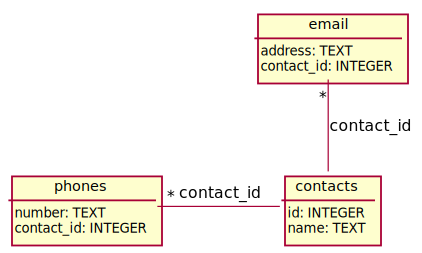

# Задача 03A. Создание простой базы контактов

Автор: О. Константинов Ограничение времени: 1 сек
Входной файл: test.db Ограничение памяти: 256 Мб
Выходной файл: test.log
Максимальный балл: 1

## Условие

Требуется по UML-схеме создать базу данных при помощи DDL-скрипта на языке SQL. При описании полей таблицы следует указывать только тип значений и связи. Поле id следует сделать первичным ключом. Схема БД в UML-нотации:

Решение следует представить в виде текстового файла, содержащего несколько SQL-запросов.

## Ограничения

Полагается, что для работы с базой данных используется SQLite3.
