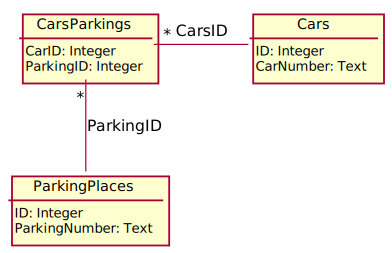

# Задача 03B. Занятые парковочные места

Автор: О. Константинов Ограничение времени: 1 сек
Входной файл: test.sql Ограничение памяти: 256 Мб
Выходной файл: test.log
Максимальный балл: 1

## Условие

На автостоянке эксплуатируется БД, в которой содержится информация о том, какому автомобилю из Cars принадлежит то или иное паковочное место из ParkingPlaces. Для реализации связи "многие ко многим", была заведена таблица CarsParkings, где автомобилю сопоставляется конкретное пронумерованное место на стоянке. Каждый автомобиль может иметь несколько парковочных мест. Ниже представлено детальное DDL-описание таблиц:

```sql
TABLE Cars ( -- машины
    ID        INTEGER PRIMARY KEY AUTOINCREMENT -- уникальный идентификатор
                      NOT NULL,
    CarNumber TEXT    NOT NULL -- номер автомобиля
                      UNIQUE
);

TABLE ParkingPlaces ( -- парковочные места
    ID            INTEGER PRIMARY KEY AUTOINCREMENT -- уникальный идентификатор
                          NOT NULL,
    ParkingNumber TEXT    NOT NULL -- номер парковочного места
                          UNIQUE
);

TABLE CarsParkings ( -- принадлежность парковочного места автомобилю
    CarID     INTEGER REFERENCES Cars (ID) -- идентификатор автомобиля
                      NOT NULL,
    ParkingID INTEGER REFERENCES ParkingPlaces (ID) -- идентификатор парковочного места
                      NOT NULL,
    UNIQUE (
        CarID,
        ParkingID
    )
);
```

Требуется вывести все автомобили, у которых есть парковочные места. Схема БД в UML-нотации:



Результатом выполнения запроса должен быть список кортежей (CarNumber, ParkingNumber). Описание полей запроса:

- CarNumber - номер автомобиля;
- ParkingNumber - номер парковочного места.

Решение следует представить в виде текстового файла, содержащего единственный SQL-запрос.

## Формат входного файла

[Пример тестовой БД.](https://imcs.dvfu.ru/cats/static/download/att/GLV80gb9dGYow8lk63e1DHN06Ghnuulo_example.db)

## Ограничения

Полагается, что для работы с базой данных используется SQLite3.
